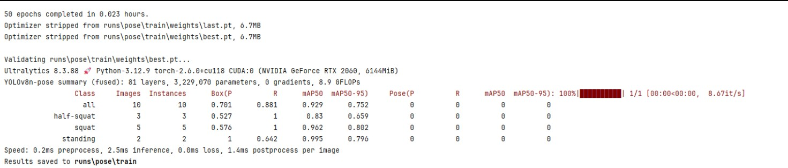
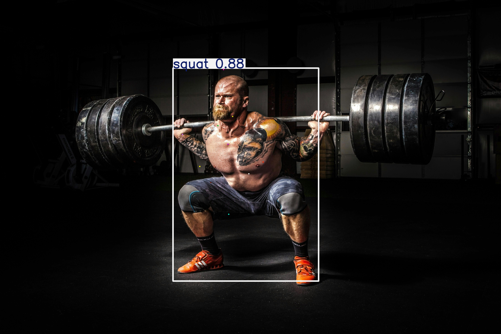
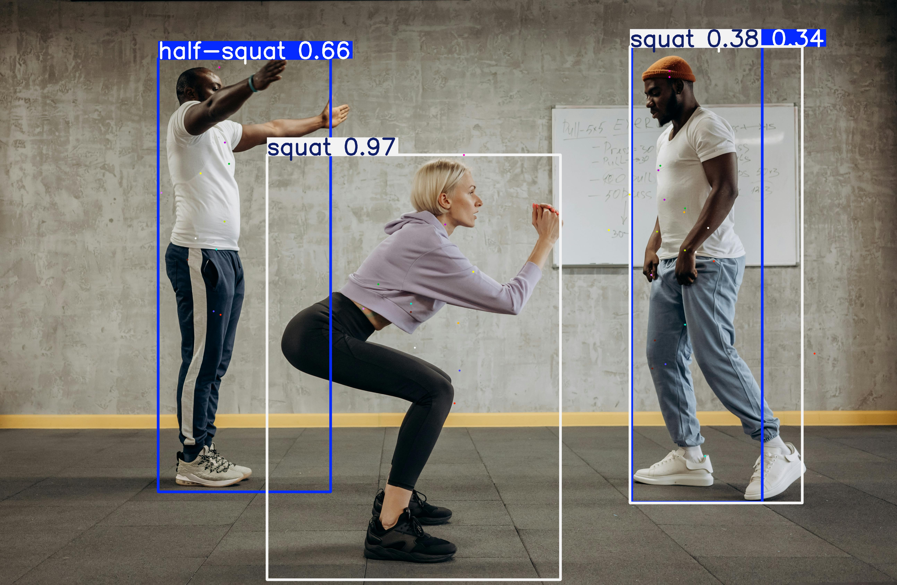
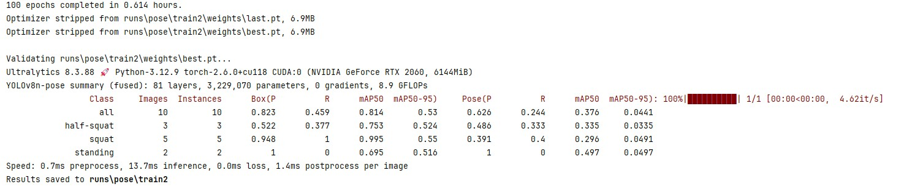
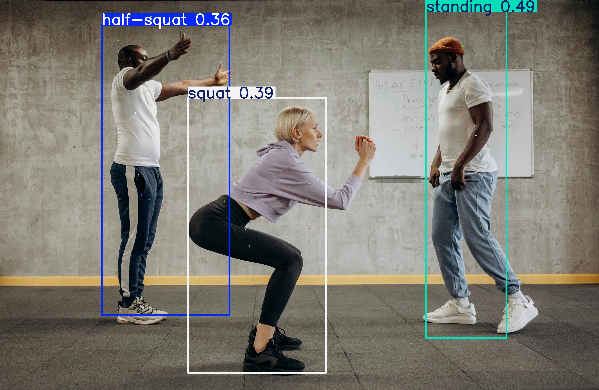

# YOLOv8 Exercise Detection

This project focuses on detecting exercise movements using YOLOv8. Currently, the model is trained to recognize different squat positions.

📹 **Demo Video**
[yolo-model/result.mp4](yolo-model/result.mp4)

## 📊 First Model Results

The first model was trained with **50 epochs**, and its performance was evaluated using key YOLO metrics:



- **mAP50:** 0.929 (overall)
- **mAP50-95:** 0.752 (overall)
- **Class-wise mAP50:**
  - Half-Squat: 0.83
  - Squat: 0.962
  - Standing: 0.995

The model performed well in detecting different squat positions but showed inconsistencies in distinguishing between similar postures like half-squat and standing.

**Results:**
<p align="center">
  
  
</p>

---

## 📊 Second Model Results

After refining the dataset and increasing training to **100 epochs**, the second model showed improvements in some areas but challenges remained:



- **mAP50:** 0.814 (slight decrease)
- **mAP50-95:** 0.376 (decrease)
- **Class-wise mAP50:**
  - Half-Squat: 0.753
  - Squat: 0.995
  - Standing: 0.695

While the squat detection remained strong (mAP50: **0.995**), half-squat recognition slightly declined. The dataset size and diversity might need further adjustments.

**Results:**


**Results:**
<p align="center">
  
  
</p>

---

## 🛠 How to Test the Model

### **1️⃣ Image Detection**
Run:
```bash
python yolo-model/test-image.py --source path/to/image.jpg
```

### **2️⃣ Video Detection**
Run:
```bash
python yolo-model/test-video.py --source path/to/video.mp4
```

### **3️⃣ Live Webcam Detection**
Run:
```bash
python yolo-model/test-webcam.py
```

---

## ⚠️ Limitations & Future Improvements
- Currently, the model only detects squats.
- Class differentiation (e.g., half-squat vs. standing) still needs refinement.
- Future versions will include additional exercises and improved data augmentation.

Any feedback or contributions are welcome!